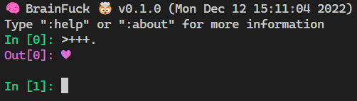

# pyfucc

[BrainFuck](https://esolangs.org/wiki/Brainfuck) interpreter, implemented in Python.



> No external dependencies needed beyond the Python standard library.

## BrainFuck

```
Command 	Description
-------   -----------
> 	      Move the pointer to the right
< 	      Move the pointer to the left
+ 	      Increment the memory cell at the pointer
- 	      Decrement the memory cell at the pointer
. 	      Output the character signified by the cell at the pointer
, 	      Input a character and store it in the cell at the pointer
[ 	      Jump past the matching ] if the cell at the pointer is 0
] 	      Jump back to the matching [ if the cell at the pointer is nonzero
$         Print debug
```

## Source File

Run files ending in `.bf`

```powershell
python .\pyfucc\main.py --src .\examples\helloworld.bf
```

## REPL

The same set of cells are used for a single session

Some convenience methods built into the REPL

```
:help   Help
:exit   Exit REPL
:about  More information about BrainFuck
:reset  Reset program state
:undo   Undo the last operation
```

-----

**Table of Contents**

- [pyfucc](#pyfucc)
  - [BrainFuck](#brainfuck)
  - [Source File](#source-file)
  - [REPL](#repl)
  - [Installation](#installation)
  - [License](#license)

## Installation

```console
pip install pyfucc
```

## License

`pyfucc` is distributed under the terms of the [MIT](https://spdx.org/licenses/MIT.html) license.
